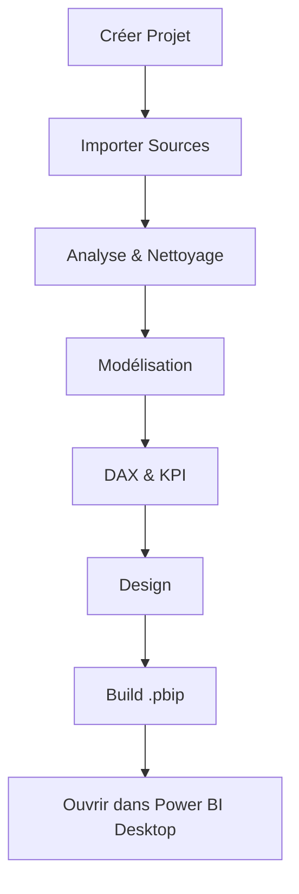

# BI Architect AI

> **From Raw Data to Executive Dashboard**
>
> Une application Streamlit qui genere des projets Power BI (.pbip) complets a partir de donnees brutes (CSV, Excel, PostgreSQL), avec modele semantique TMDL, mesures DAX, KPI, design et documentation.

---

## 🚀 Quick Start

### Prérequis
- Python 3.10+
- Git
- Power BI Desktop (pour ouvrir les fichiers .pbip generes)

### Installation

1. **Cloner le repository**
   ```bash
   git clone <url-du-repository>
   cd AI-PowerBI-Analyst
   ```

2. **Créer l'environnement virtuel**
   ```bash
   python -m venv .venv
   ```

3. **Installer les dépendances**
   ```bash
   # Sur Windows
   .venv\Scripts\pip install -r requirements.txt
   
   # Sur macOS/Linux
   source .venv/bin/activate
   pip install -r requirements.txt
   ```

4. **Configurer les clés API**
   Créez un fichier `.env` à la racine avec vos clés :
   ```env
   TENCENT_API_KEY=votre_cle_tencent
   AGNES_API_KEY=votre_cle_agnes
   AGNES_BASE_URL=https://apihub.agnes-ai.com/v1
   ```

5. **Lancer l'application**
   ```bash
   # Sur Windows
   .venv\Scripts\streamlit run app.py
   
   # Sur macOS/Linux
   .venv/bin/streamlit run app.py
   ```

L'application s'ouvre dans votre navigateur à l'adresse `http://localhost:8501`

---

## 📁 Structure du Projet

```
AI-PowerBI-Analyst/
├── app.py                          # Page d'accueil
├── README.md                       # Ce fichier
├── requirements.txt                # Dépendances Python
├── .env                            # Clés API (à ne pas commiter)
├── config/
│   └── settings.json               # Configuration des fournisseurs IA
├── agents/                         # Agents spécialisés
│   ├── ai_auditor.py               # Audit des projets
│   ├── ai_data_engineer.py         # Nettoyage & analyse données
│   ├── bi_agent.py                 # Génération DAX & KPI
│   ├── bi_architect.py             # Modélisation sémantique
│   ├── powerbi_builder.py          # Génération .pbip
│   └── ux_designer.py              # Thème & layout
├── core/                           # Modules centraux
│   ├── advisor.py                  # Conseils IA
│   ├── ai_orchestrator.py          # Orchestration des appels IA
│   ├── assistant.py                # Explications pédagogiques
│   ├── database_manager.py         # Gestion base de données
│   ├── file_manager.py             # Gestion des fichiers
│   ├── logger.py                   # Logging
│   ├── project_manager.py          # Gestion des projets
│   └── workflow_engine.py          # Moteur de workflow
├── pages/                          # Pages Streamlit
│   ├── 0_🤖_Assistant.py           # Assistant simplifié (3 étapes)
│   ├── 1_🏠_Projet.py              # Création/Ouverture projet
│   ├── 2_📂_Sources.py             # Import des données
│   ├── 3_🧹_Data_Engineer.py       # Nettoyage automatique
│   ├── 4_📈_Modelisation.py        # Modèle sémantique
│   ├── 5_📊_KPI_DAX.py            # Mesures & KPI
│   ├── 6_🎨_Design.py              # Design du rapport
│   ├── 7_🚀_PowerBI_Builder.py     # Génération .pbip
│   ├── 8_⚙️_Settings.py           # Paramètres
│   └── 9_🔍_Auditor.py             # Audit du projet
├── utils/                          # Utilitaires
│   ├── session.py                  # État session Streamlit
│   └── ui.py                       # Composants UI
├── projects/                       # Projets générés
│   └── <nom-du-projet>/            # Contient data/, metadata/, .pbip/
├── data/                           # Fichiers d'exemple
└── logs/                           # Logs de l'application
```

---

## 🎯 Fonctionnalités

### Mode Assistant (Recommandé pour les débutants)
La page **0_🤖_Assistant.py** propose un parcours simplifié en 3 étapes :
1. **Importer vos données** (CSV, Excel)
2. **Décrire votre besoin** en langage naturel
3. **Générer automatiquement** le tableau de bord Power BI

### Mode Expert (Contrôle fin)
Les pages 1 à 9 permettent de piloter chaque étape individuellement :

| Page | Fonction | Livrable |
|------|----------|----------|
| 1_🏠_Projet | Créer/Ouvrir un projet | `projects/<nom>/project.json` |
| 2_📂_Sources | Importer des données | `projects/<nom>/data/*.csv` |
| 3_🧹_Data_Engineer | Nettoyage automatique | `*_quality_report.json`, `*_cleaning_plan.json`, `*_metadata.json` |
| 4_📈_Modelisation | Modèle en étoile | `metadata/model.json` |
| 5_📊_KPI_DAX | Mesures DAX & KPI | `metadata/dax_measures.json`, `metadata/kpi_catalog.json` |
| 6_🎨_Design | Thème & layout | `metadata/theme.json`, `metadata/layout.json` |
| 7_🚀_PowerBI_Builder | Génération .pbip | `<nom>.pbip/` (ouvrable dans Power BI Desktop) |
| 8_⚙️_Settings | Paramètres | - |
| 9_🔍_Auditor | Audit | Diagnostic complet |

---

## 🤖 Architecture IA

### Fournisseurs configurés
Le projet utilise deux fournisseurs d'IA, configurables dans `config/settings.json` :

| Fournisseur | Modèle | Usage |
|-------------|--------|-------|
| ** Agnes** | agnes-2.0-flash | Modélisation, DAX, Design, Storytelling |
| **Tencent Hunyuan** | tencent/hy3 | Tâches générales |

### Routage automatique
Les tâches sont automatiquement routées vers le fournisseur le plus adapté :
- `preprocessing` → Agnes
- `modeling` → Agnes
- `dax` → Agnes
- `design` → Agnes
- `storytelling` → Agnes
- `expert_powerbi` → Agnes
- `default` → Agnes

### Personnalisation
Pour changer de fournisseur ou de modèle, modifiez `config/settings.json` :
```json
{
  "routing_rules": {
    "modeling": {"provider": "tencent_hunyuan", "model": "hy3"}
  }
}
```

---

## 📊 Workflow



Chaque étape produit des **livrables JSON** stockés dans `projects/<nom>/metadata/`.

---

## 📂 Projets Exemple

Le dossier `projects/` contient des exemples de projets générés :

- **Resource humaine** : Projet complet avec 4 sources (Absences, Departements, Employes, Evaluations) et .pbip généré
- **Vente** : Projet complet avec 8 sources (Employees, Products, Promotions, Sales, etc.) et .pbip généré

Pour créer un nouveau projet :
1. Allez sur la page **1_🏠_Projet**
2. Cliquez sur "Créer un nouveau projet"
3. Donnez un nom et une description
4. Importez vos fichiers de données

---

## 🔧 Configuration

### Variables d'environnement

| Variable | Description | Obligatoire |
|----------|-------------|-------------|
| `TENCENT_API_KEY` | Clé API Tencent Hunyuan | Non (si Agnes seulement) |
| `AGNES_API_KEY` | Clé API Agnes | **Oui** |
| `AGNES_BASE_URL` | URL de l'API Agnes | Oui |

### Fichiers de configuration

- `.env` : Clés API (exclu du git via `.gitignore`)
- `config/settings.json` : Configuration des modèles et routage IA
- `.gitignore` : Fichiers exclus du versionnage

---

## 🎨 Design

L'application utilise une palette de couleurs moderne :
- Fond : `#f5f7fb`
- Surface : `#ffffff`
- Primaire : `#4f46e5` (indigo)
- Accent : `#0ea5e9` (bleu ciel)
- Succès : `#16a34a` (vert)
- Avertissement : `#d97706` (orange)

---

## 🐛 Dépannage

### Erreur : ModuleNotFoundError
```bash
# Assurez-vous d'utiliser l'interpréteur du venv
.venv\Scripts\python votre_script.py
```

### Erreur : Clé API manquante
Vérifiez que votre fichier `.env` contient bien :
```env
AGNES_API_KEY=votre_cle
AGNES_BASE_URL=https://apihub.agnes-ai.com/v1
```

### Les fichiers .pbip ne s'ouvrent pas
- Assurez-vous d'avoir **Power BI Desktop** installé
- Les fichiers .pbip sont générés dans `projects/<nom>/<Nom>.pbip/`
- Ouvrez le dossier `.pbip` (pas le fichier lui-même) dans Power BI Desktop

---

## 📄 Licence

Ce projet est un outil interne. Toute utilisation doit respecter les conditions d'utilisation des API tierces (Tencent, Agnes).

---

## 🤝 Contribuer

1. Forker le projet
2. Créer une branche (`git checkout -b feature/nouvelle-fonctionnalite`)
3. Commiter vos changements (`git commit -m 'Ajout nouvelle fonctionnalite'`)
4. Pousser vers la branche (`git push origin feature/nouvelle-fonctionnalite`)
5. Ouvrir une Pull Request

---

## 📞 Contact

Pour toute question, contactez l'équipe du projet.

---

*Generated by Mistral Vibe. Co-Authored-By: Mistral Vibe <vibe@mistral.ai>*
